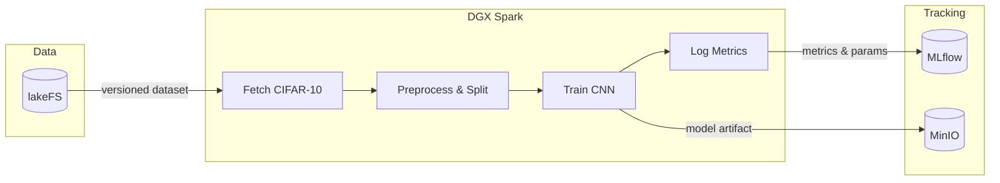
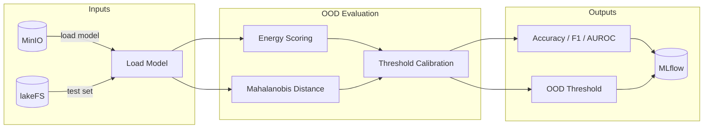
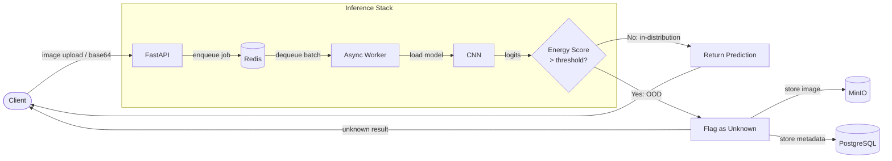
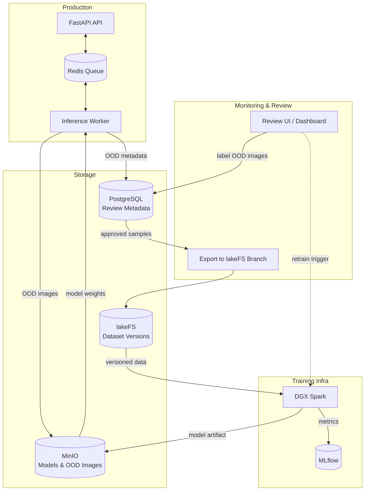
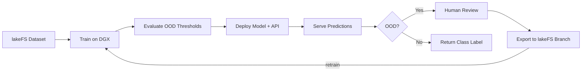

# Architecture Diagrams

## Training Pipeline

```mermaid
flowchart LR
    subgraph Data
        LFS[(lakeFS)]
    end

    subgraph DGX Spark
        FETCH[Fetch CIFAR-10] --> PREPROCESS[Preprocess & Split]
        PREPROCESS --> TRAIN[Train CNN]
        TRAIN --> LOG[Log Metrics]
    end

    subgraph Tracking
        MLF[(MLflow)]
        MINIO_A[(MinIO)]
    end

    LFS -->|versioned dataset| FETCH
    LOG -->|metrics & params| MLF
    TRAIN -->|model artifact| MINIO_A
```

## Evaluation Pipeline

```mermaid
flowchart LR
    subgraph Inputs
        MINIO_M[(MinIO)] -->|load model| EVAL
        LFS[(lakeFS)] -->|test set| EVAL
    end

    subgraph OOD Evaluation
        EVAL[Load Model] --> ENERGY[Energy Scoring]
        EVAL --> MAHAL[Mahalanobis Distance]
        ENERGY --> CALIB[Threshold Calibration]
        MAHAL --> CALIB
    end

    subgraph Outputs
        CALIB --> METRICS[Accuracy / F1 / AUROC]
        CALIB --> THRESH[OOD Threshold]
        METRICS --> MLF[(MLflow)]
        THRESH --> MLF
    end
```

## Inference Pipeline

```mermaid
flowchart LR
    CLIENT([Client]) -->|image upload / base64| API

    subgraph Inference Stack
        API[FastAPI] -->|enqueue job| REDIS[(Redis)]
        REDIS -->|dequeue batch| WORKER[Async Worker]
        WORKER -->|load model| MODEL[CNN]
        MODEL -->|logits| OOD{Energy Score<br/>> threshold?}
    end

    OOD -->|No: in-distribution| RESULT[Return Prediction]
    OOD -->|Yes: OOD| FLAG[Flag as Unknown]
    FLAG -->|store image| MINIO[(MinIO)]
    FLAG -->|store metadata| PG[(PostgreSQL)]
    RESULT --> CLIENT
    FLAG -->|unknown result| CLIENT
```

## ML Infrastructure & Feedback Loop

```mermaid
flowchart TB
    subgraph Production
        API[FastAPI API]
        WORKER[Inference Worker]
        REDIS[(Redis Queue)]
        API <--> REDIS
        REDIS <--> WORKER
    end

    subgraph Storage
        MINIO[(MinIO<br/>Models & OOD Images)]
        PG[(PostgreSQL<br/>Review Metadata)]
        LFS[(lakeFS<br/>Dataset Versions)]
    end

    subgraph Monitoring & Review
        REVIEW[Review UI / Dashboard]
        REVIEW -->|label OOD images| PG
        PG -->|approved samples| EXPORT[Export to lakeFS Branch]
        EXPORT --> LFS
    end

    subgraph Training Infra
        DGX[DGX Spark]
        MLF[(MLflow)]
        LFS -->|versioned data| DGX
        DGX -->|metrics| MLF
        DGX -->|model artifact| MINIO
    end

    WORKER -->|OOD images| MINIO
    WORKER -->|OOD metadata| PG
    MINIO -->|model weights| WORKER
    REVIEW -.->|retrain trigger| DGX
```

## End-to-End Flow (Summary)

```mermaid
flowchart LR
    A[lakeFS Dataset] --> B[Train on DGX]
    B --> C[Evaluate OOD Thresholds]
    C --> D[Deploy Model + API]
    D --> E[Serve Predictions]
    E --> F{OOD?}
    F -->|Yes| G[Human Review]
    G --> H[Export to lakeFS Branch]
    H -->|retrain| B
    F -->|No| I[Return Class Label]
```
